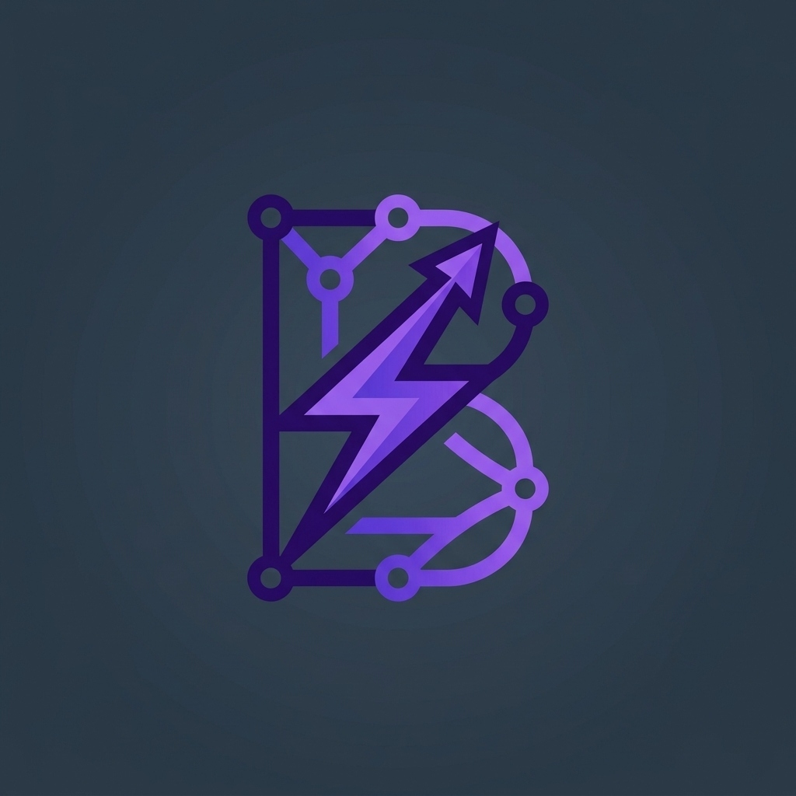

# BizFlow AI — Small Business Workflow & WhatsApp Task Automation



**BizFlow AI** is a sleek, human-engineered SaaS platform built to help small businesses organize, track, and automate daily digital workflows. It bridges the gap between chaotic WhatsApp customer communications, verbal instructions, and structured task execution.

---

## 🎯 Problem Statement

Small business owners and managers frequently handle operational requests, vendor orders, client invoices, and emergency support tickets through unorganized **WhatsApp messages and chat threads**. Without a centralized system, action items get lost, deadlines are missed, and business velocity drops.

### The Solution: BizFlow AI
BizFlow AI provides an instant, zero-friction workspace where raw unstructured chat threads turn into actionable Kanban cards with priority levels, department tags, deadlines, and smart subtasks.

---

## ✨ Key Features

### 📋 1. Streamlined Kanban Workspace
- **3-Stage Workflow:** Drag-and-drop tasks across **To Do**, **In Progress**, and **Done** columns.
- **Minimalist Card UI:** Linear/Notion-inspired cards featuring priority badges (`High`, `Medium`, `Low`), department tags (`Finance`, `Operations`, `Marketing`, `Support`, `Sales`), due dates, assignee avatars, and expandable subtask checklists.
- **Live Counters:** Real-time metrics for total tasks, active executions, completed items, and overdue flags.

### ⚡ 2. WhatsApp Task Extractor (Killer Feature)
- **Raw Text Parsing:** Paste raw WhatsApp chat threads or select business sample presets.
- **Smart Field Auto-Detection:** Automatically extracts task titles, action items, priority flags (`ASAP`, `Urgent`), department tags (`Invoice` → Finance, `Order` → Operations), upcoming deadlines, and generates initial subtask checklists.
- **One-Click Import:** Review extracted tasks and import them directly onto the Kanban board.

### 📊 3. Executive Analytics & Velocity Insights
- **Department Workload Chart:** Chart.js doughnut chart breaking down task distribution by business department.
- **Productivity Velocity Trend:** 7-day velocity line chart tracking completed tasks against active backlog.
- **Workflow Efficiency Score:** Calculated score tracking workspace completion velocity.

### 🔍 4. Command Palette & Keyboard Shortcuts
- Press `⌘K` or `Ctrl+K` to open the search and command palette.
- Press `N` to quickly open the Create Task modal.
- Press `ESC` to close any open modal or drawer.

### 💾 5. Data Persistence & Backup
- **Local Storage Engine:** Automatically saves all task modifications, subtask toggles, and state changes to browser `localStorage`.
- **JSON Export & Reset:** Export complete workspace backups as a `.json` file or reset to sample demo data at any time.

---

## 🛠️ Technology Stack

- **Frontend:** HTML5, Vanilla JavaScript (ES6+ State Store architecture)
- **Styling:** Custom CSS Design System + Tailwind CSS CDN
- **Icons:** FontAwesome 6 & Lucide Icons
- **Data Visualizations:** Chart.js
- **Animations:** Canvas Confetti & Glassmorphism Transitions
- **Backend / Deployment:** Node.js, Express, Docker, Google Cloud Run

---

## 📂 Project Structure

```
bizflow-ai/
├── index.html          # Main Single-Page Application (SPA)
├── logo.jpg            # Official BizFlow Logo Icon
├── css/
│   └── styles.css      # Custom design system tokens & Linear-style UI components
├── js/
│   ├── app.js          # Core State Store, LocalStorage Engine, & Toast Utility
│   ├── kanban.js       # Drag & Drop Kanban Board & Card Rendering Engine
│   ├── ai-extractor.js # WhatsApp Chat Parser & Batch Importer Engine
│   ├── charts.js       # Chart.js Doughnut & Velocity Line Chart Controllers
│   └── modals.js       # Modal Controllers, Tab View Switcher, & Keybindings
├── package.json        # Node.js dependencies & npm start script
├── server.js           # Express web server for Cloud Run / Docker
├── server.ps1          # Standalone PowerShell HTTP server fallback
└── Dockerfile          # Production Node.js Alpine container manifest
```

---

## 🚀 Getting Started

### Option 1: Direct Browser Access (Instant & Zero Setup)
BizFlow AI is built as a self-contained client-side web application. You can run it immediately without installing Node.js or any backend servers:

1. Open your browser.
2. Double-click [`index.html`](file:///c:/Users/Yash%20Raj/.gemini/antigravity-ide/scratch/bizflow-ai/index.html) or drag it into Chrome, Edge, Firefox, or Brave.

---

### Option 2: Run Locally via Node.js Express Server

1. **Install Dependencies:**
   ```bash
   npm install
   ```

2. **Start the Express Server:**
   ```bash
   npm start
   ```

3. **Open Application:**
   Navigate to `http://localhost:8080` in your web browser.

---

## 🐳 Docker & Google Cloud Run Deployment

BizFlow AI includes deployment-ready container configurations for **Google Cloud Run**.

### Build and Run with Docker Locally

```bash
# Build Docker image
docker build -t bizflow-ai .

# Run container on port 8080
docker run -p 8080:8080 bizflow-ai
```

### Deploy to Google Cloud Run

```bash
# Deploy directly from source directory
gcloud run deploy bizflow-ai \
  --source . \
  --port 8080 \
  --allow-unauthenticated \
  --region us-central1
```

---

## 📜 License

Distributed under the MIT License. Built for small business workflow productivity.
